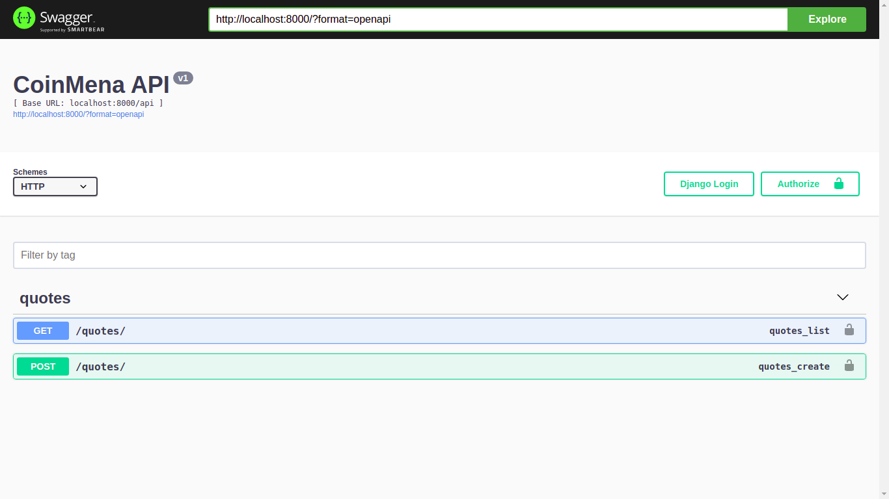
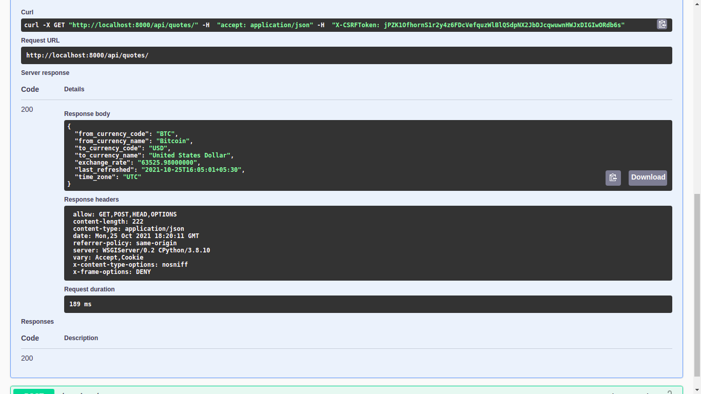

# Coin Mena

This is Django and Django Rest Framework Project for getting data from alphavantage.co website api for every hour and store it in postgresql database.

## Acknowledgements

 - [Alphavantage](https://www.alphavantage.co/)
 
  
## API Reference

#### Get the exchange rate

```http
  GET /api/quotes
```

#### Trigger the data from alphavantage

```http
  POST /api/quotes/
```

| Parameter | Type     | Description                       |
| :-------- | :------- | :-------------------------------- |
| `from_currency_code`      | `string` | **Required**. |
`to_currency_code`      | `string` | **Required**.  |

  
## Deployment

To deploy this project run

```bash
  docker-compose up --build
```

  
## Environment Variables

To run this project, you will need to add the following environment variables to your .env file

`API_KEY` from alphavantage website

  
## Screenshots



## Run Locally

Clone the project

```bash
  git clone https://github.com/chezhian-softsuave/coinmena.git
```

Go to the project directory

```bash
  cd coinmena
```

Install dependencies

```bash
   docker-compose up --build
```

open the browser and type

```bash
   http://localhost:8000
```

  